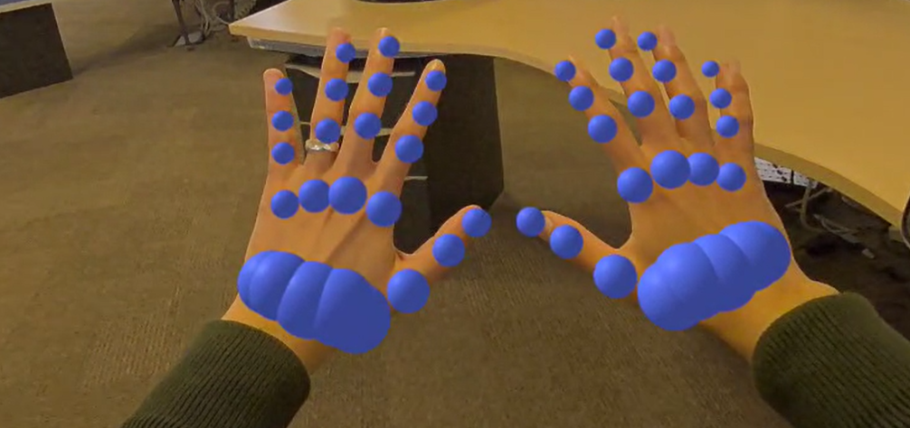

# Hand Input Module A-Frame Demo

This is an A-Frame demo of the [Hand Input Module](https://www.w3.org/TR/webxr-hand-input-1/) that is part of the [WebXR Device API](https://www.w3.org/TR/webxr/). The demo was developed as part of a blog series for our [Samsung Internet Developers blog](https://medium.com/samsung-internet-dev).

The three part blog series explores the following:

- [Part 1: accessing the API and rendering hand skeletons](https://medium.com/samsung-internet-dev/how-to-use-the-hand-input-module-in-a-frame-part-1-e836c83fdc5e)
- [Part 2: adding simple interactions](https://medium.com/samsung-internet-dev/how-to-use-the-hand-input-module-in-a-frame-part-2-a5d26e2de37a)
- Part 3: performing gesture detection *(blog post out soon)*

## Notes

- You will need a device that supports the `hand-tracking` feature to run the demo.
- The demo was developed using A-Frame, but the code should also run using other online code editors.

## Screenshots

### Part 1

### Part 2

### Part 3

